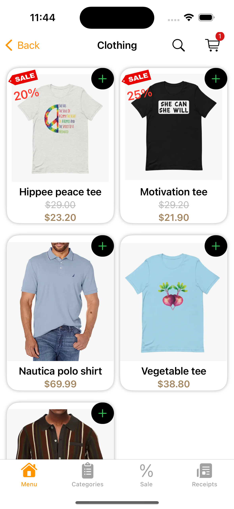
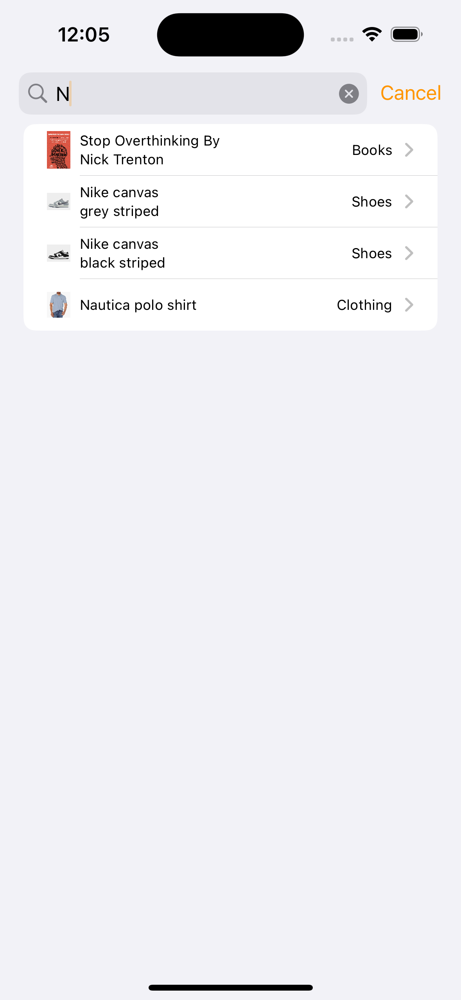
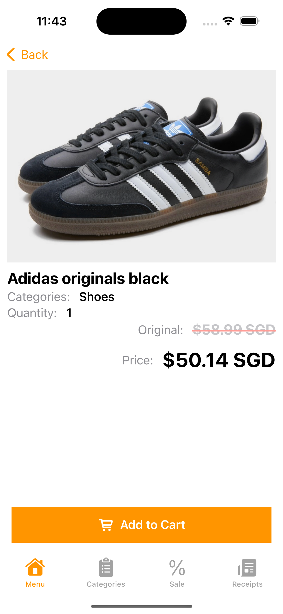
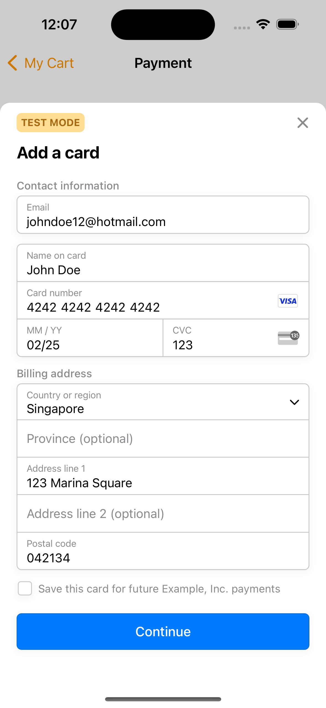
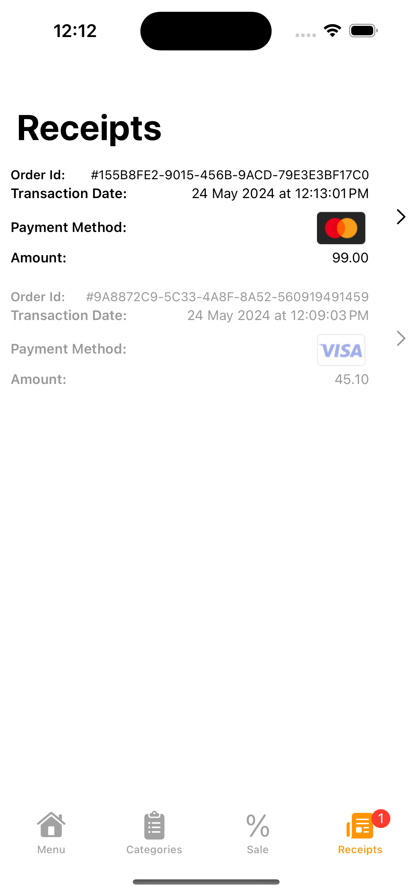
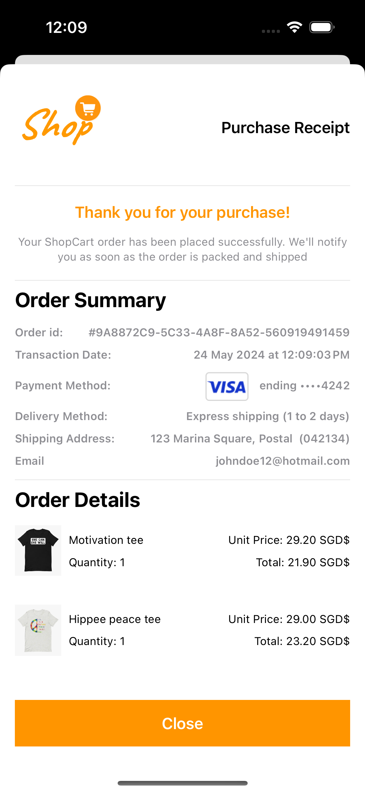

## E-Commerce iOS shopping app with Stripe payment integration

Interactive E-Commerce iOS shopCart App with Stripe payment sdk integration. 

## Features
- Browse through items by `categories`
- Add and remove items from cart
- Customized with Stripe sdk Payment Sheet
- Integrated with backend server API to authorized payment and generate paymentIntent secret
- Receive in-app notification upon successful payment transaction
- Payment recorded receipts of all purchase transactions

## Screens
- Browsing products    
 &nbsp;  &nbsp;  &nbsp; 

   

- Payment process and confirmation    
 &nbsp;  &nbsp;  &nbsp; 
